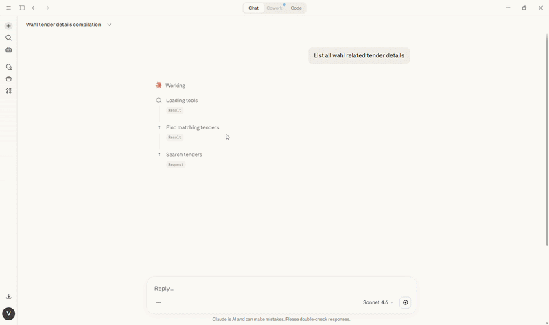
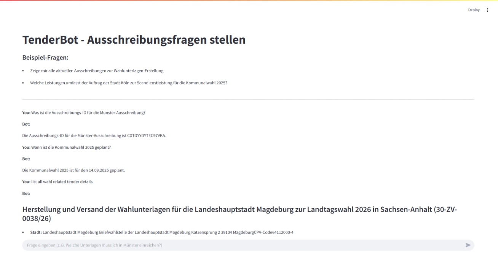

# TenderAgent: RAG-Powered Tender Assistant

An end-to-end AI system that automatically fetches, indexes, and answers questions about public procurement tenders using Retrieval-Augmented Generation (RAG).

Built for the German public tender portal [service.bund.de](https://www.service.bund.de), queries tenders related to election materials (Wahlunterlagen) and answers user questions in natural language.


## Demo

> **User:** Welche Leistungen umfasst der Auftrag der Stadt Köln zur Scandienstleistung?
>
> **TenderBot:** Der Auftrag der Stadt Köln umfasst die Scandienstleistungen für die Kommunalwahl 2025, einschließlich der Digitalisierung von Wahlunterlagen, Qualitätskontrolle und fristgerechter Lieferung...


## Architecture

```
┌─────────────────────────────────────────────────────────┐
│                  INGESTION PIPELINE                      │
│  (runs every 6 hours via scheduler)                      │
│                                                          │
│  service.bund.de RSS ──► fetch_tenders.py               │
│         │                      │                         │
│         ▼                      ▼                         │
│   Parse metadata          Selenium scraper               │
│   (deadline, city)        extracts all tab URLs          │
│         │                      │                         │
│         ▼                      ▼                         │
│   tenders_index.json      crwl → markdown files          │
│                                │                         │
│                                ▼                         │
│                    Clean markdown → chunk →              │
│                    OpenAI Embeddings → ChromaDB          │
└─────────────────────────────────────────────────────────┘
                           │
                           ▼
┌─────────────────────────────────────────────────────────┐
│                   QUERY PIPELINE                         │
│                                                          │
│  User Question                                           │
│       │                                                  │
│       ▼                                                  │
│  List query? ──Yes──► format_tender_list()              │
│       │ No                                               │
│       ▼                                                  │
│  Detect city/title ──► filter ChromaDB retrieval        │
│       │                                                  │
│       ▼                                                  │
│  ChromaDB top-k retrieval (OpenAI embeddings)           │
│       │                                                  │
│       ▼                                                  │
│  FlashRank reranker (ms-marco-MiniLM-L-12-v2)          │
│       │                                                  │
│       ▼                                                  │
│  GPT-4 + LangChain RetrievalQA                         │
│       │                                                  │
│       ▼                                                  │
│  Answer + Sources ──► Streamlit UI                      │
└─────────────────────────────────────────────────────────┘
```


## Tech Stack

| Layer | Technology |
|---|---|
| LLM | GPT-4 via LangChain |
| Embeddings | OpenAI text-embedding-ada-002 |
| Vector DB | ChromaDB |
| Reranker | FlashRank (ms-marco-MiniLM-L-12-v2) |
| Web Scraping | Selenium + BeautifulSoup + crwl |
| Data Feed | RSS via feedparser |
| Frontend | Streamlit |
| Scheduler | schedule (6-hour intervals) |
| Data Validation | Pydantic |


## Project Structure

```
tender-assistant-rag/
├── src/
│   ├── app.py              # Streamlit UI + RAG query logic
│   ├── fetch_tenders.py    # RSS fetcher, scraper, vector DB builder
│   ├── llm.py              # Standalone CLI query interface
│   └── pipeline.py         # Scheduled pipeline runner
├── data/
│   └── sample_tenders/     # Sample public tender markdown files
├── docs/
│   └── architecture.md     # Detailed architecture notes
├── .env.example
├── .gitignore
├── requirements.txt
└── README.md
```


## Setup & Run

### 1. Clone the repo
```bash
git clone https://github.com/vaishnavi28-s/tender-assistant-rag.git
cd tender-assistant-rag
```

### 2. Install dependencies
```bash
pip install -r requirements.txt
```

### 3. Set your API key
```bash
cp .env.example .env
# Add your OpenAI API key to .env
```

### 4. Run the ingestion pipeline
```bash
python src/fetch_tenders.py
```

### 5. Launch the Streamlit app
```bash
streamlit run src/app.py
```

### 6. Run scheduled pipeline (optional)
```bash
python src/pipeline.py
```


## Sample Questions

- `Zeige mir alle aktuellen Ausschreibungen zur Wahlunterlagen-Erstellung.`
- `Welche Fristen gelten für die Kommunalwahl Köln 2025?`
- `Welche Unterlagen muss ich in Münster einreichen?`
- `List all tenders`


## Key Features

- **Auto-ingestion** - fetches new tenders every 6 hours from live RSS feed
- **Smart retrieval** - detects city/title mentions to filter ChromaDB before retrieval
- **Reranking** - FlashRank reranker improves precision over basic top-k
- **Source-grounded answers** - GPT-4 answers only from retrieved context, no hallucination
- **Public data only** - built entirely on publicly available government tenders


## Note on Data

This project uses publicly available procurement data from [service.bund.de](https://www.service.bund.de). No proprietary or sensitive data is stored in this repository. Sample tender files in `data/sample_tenders/` are publicly accessible government documents.


## MCP Server: Claude Desktop Integration

TenderBot can also run as an MCP server, letting you query tenders directly from Claude Desktop without opening the Streamlit app.

### Tools exposed to Claude

| Tool | Description |
|---|---|
| `search_tenders(question)` | Answer any question using RAG over tender documents |
| `list_all_tenders(limit)` | List all tenders sorted by deadline |
| `get_tender_by_city(city)` | Get tenders for a specific city |
| `check_deadlines()` | Get all upcoming deadlines |
| `fetch_latest_tenders()` | Scrape and index fresh tenders from service.bund.de |
| `find_matching_tenders(query)` | Find which documents match a query |

### Setup on Windows

1. Install MCP:
```bash
pip install mcp[cli]
```

2. Open your Claude Desktop config at:
```
C:\Users\<YourName>\AppData\Roaming\Claude\claude_desktop_config.json
```

3. Add this:
```json
{
  "mcpServers": {
    "tenderbot": {
      "command": "python",
      "args": ["C:\\path\\to\\tender-assistant-rag\\src\\mcp_server.py"],
      "env": {
        "OPENAI_API_KEY": "your-openai-api-key-here"
      }
    }
  }
}
```

4. Replace the path, restart Claude Desktop, and ask:
   - *"What tenders are due this week?"*
   - *"Search tenders for Köln"*
   - *"Fetch the latest tenders from service.bund.de"*

## MCP Agent Demo


## Demo Screenshots



## Connect
[](https://www.linkedin.com/in/vaishnavi-sreekumar-48199a197/)
[](https://github.com/vaishnavi28-s)
